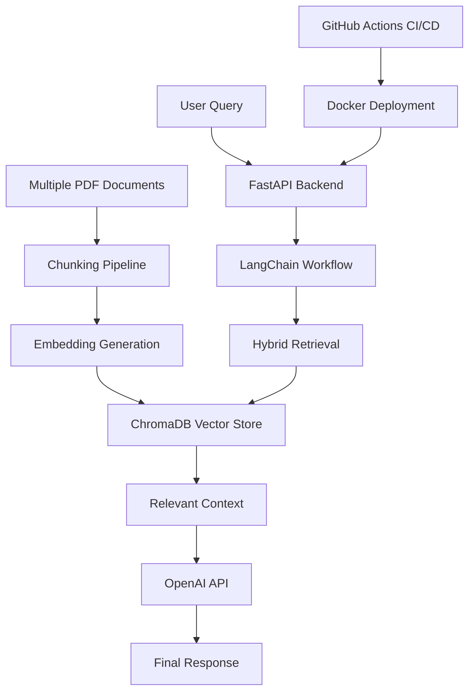

# multi-document-analysis-tool

Multi-document RAG analysis system for semantic retrieval and contextual question answering across multiple uploaded documents.

---

# Project Overview

This project demonstrates a production-oriented multi-document AI workflow using Retrieval-Augmented Generation (RAG), semantic retrieval, vector databases, and LLM-powered contextual analysis.

Users can upload multiple PDF documents, process document content into semantic chunks, retrieve relevant information using hybrid retrieval workflows, and generate grounded responses through LLM inference.

The project focuses on backend AI engineering concepts including document ingestion pipelines, vector search, caching workflows, CI/CD automation, deployment infrastructure, and modular FastAPI architecture.

---

# Key Features

- Multi-document PDF ingestion
- Semantic chunking pipeline
- Embedding generation workflow
- Context-aware semantic retrieval
- Hybrid retrieval workflow
- Vector similarity search
- FastAPI REST API backend
- ChromaDB integration
- Cross-document semantic analysis
- Dockerized deployment
- CI/CD automation
- Modular backend architecture
- Logging and caching workflows

---

# Tech Stack

## Backend
- Python
- FastAPI
- Uvicorn

## AI / NLP
- OpenAI API
- LangChain
- sentence-transformers

## Vector Database
- ChromaDB

## Deployment / DevOps
- Docker
- docker-compose
- AWS EC2 (eu-central-1)
- GitHub Actions CI/CD

---

# Architecture

---

# Example Workflow
1. Upload Multiple Documents

Users upload multiple PDF documents through the API.

2. Process Documents

Documents are chunked into semantic sections for retrieval.

3. Generate Embeddings

Embeddings are generated for semantic vector search.

4. Store in ChromaDB

Chunks and embeddings are stored in the vector database.

5. Retrieve Relevant Context

Relevant chunks are retrieved using semantic similarity and hybrid retrieval workflows.

6. Generate Final Response

The LLM generates grounded responses using retrieved context.

Example Questions
Compare concepts across documents
Summarize uploaded documents
Extract important topics
Analyze similarities between documents
Retrieve document-specific information
Local Development
Clone Repository
git clone https://github.com/rajavinay-eng/multi-document-analysis-tool.git
Install Dependencies
pip install -r requirements.txt
Run FastAPI Backend
uvicorn api:app --reload
Deployment

The application is containerized using Docker and deployed on AWS EC2 (eu-central-1) using docker-compose.

CI/CD pipelines are managed through GitHub Actions.

Engineering Focus Areas

This project demonstrates practical experience with:

Multi-document RAG workflows
Semantic retrieval pipelines
Hybrid search systems
Vector databases
FastAPI backend development
REST API engineering
AI API integration
Dockerized deployment
CI/CD automation
Cloud deployment workflows
Modular backend architecture
Context-aware LLM applications
Future Improvements
Authentication and authorization
Streaming responses
Conversation memory
Async processing workflows
Monitoring and observability
Advanced reranking models
Multi-user support
Environment Variables

Create a .env file:

OPENAI_API_KEY=your_api_key
