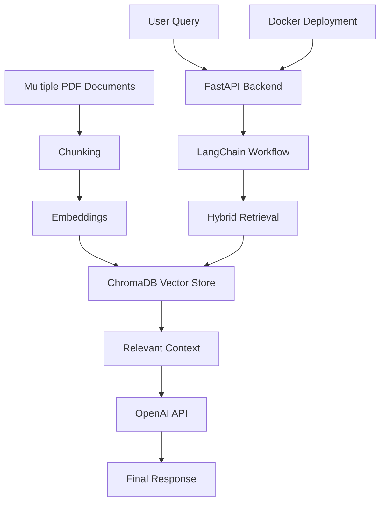

---

```markdown id="rj3t8m"
# multi-document-analysis-tool

Multi-document RAG analysis system for semantic retrieval and contextual question answering across multiple uploaded documents.

---

# Overview

This project demonstrates a multi-document AI workflow using Retrieval-Augmented Generation (RAG), vector search, and LLM-based contextual analysis.

Users can upload multiple PDF documents, process document content into semantic chunks, retrieve relevant information using vector similarity search, and generate grounded responses through LLM inference.

The project focuses on backend AI engineering concepts including document ingestion pipelines, retrieval workflows, vector databases, caching, deployment, and modular architecture.

---

# Key Features

- Multi-document PDF ingestion
- Semantic chunking pipeline
- Embedding generation workflow
- Context-aware retrieval
- Vector similarity search
- FastAPI REST API backend
- ChromaDB integration
- Multi-document retrieval workflow
- Dockerized deployment
- Modular backend architecture
- Logging and caching workflows

---

# Tech Stack

## Backend
- Python
- FastAPI
- Uvicorn

## AI / NLP
- OpenAI API
- LangChain

## Vector Database
- ChromaDB

## Deployment
- Docker
- Render

---

# Architecture



---

# Example Workflow

## 1. Upload Multiple Documents

Users upload multiple PDF documents through the API.

## 2. Process Documents

Documents are chunked into semantic sections.

## 3. Generate Embeddings

Embeddings are generated for vector retrieval.

## 4. Store in ChromaDB

Chunks and embeddings are stored in the vector database.

## 5. Retrieve Relevant Context

Relevant chunks are retrieved using semantic similarity search.

## 6. Generate Final Response

The LLM generates grounded responses using retrieved context.

---

# Example Questions

- Compare concepts across documents
- Summarize uploaded documents
- Extract important topics
- Analyze similarities between documents
- Retrieve document-specific information

---

# Local Development

## Clone Repository

```bash
git clone https://github.com/rajavinay-eng/multi-document-analysis-tool.git
```

## Install Dependencies

```bash
pip install -r requirements.txt
```

## Run FastAPI Backend

```bash
uvicorn api:app --reload
```

---

# Deployment

The application is containerized using Docker and deployed on Render.

---

# Engineering Focus Areas

This project demonstrates practical experience with:

- Multi-document RAG workflows
- Semantic retrieval pipelines
- Vector databases
- FastAPI backend development
- AI API integration
- Dockerized deployment
- Modular backend architecture
- Context-aware LLM applications

---

# Future Improvements

- Authentication and authorization
- Streaming responses
- Conversation memory
- Async processing workflows
- Monitoring and observability
- Advanced reranking models
- Multi-user support

---

# Environment Variables

Create a `.env` file:

```env
OPENAI_API_KEY=your_api_key
```
